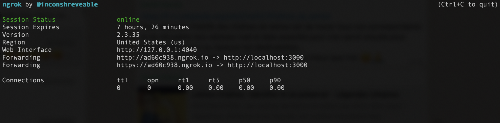

# footbalBot
> football chatbot


**Table of Contents**
- [📖 Introduction](#-introduction)
- [🕹 Use it!](#-use)
- [🛠 Notes for developping](#-notes)


## 📖  Introduction

This chatbot answers football statistics in general. You can find a complete description of its functionnalities under the next chapter.

Here is the link to our Faceboook Page: [Footbal Bot](https://www.facebook.com/Football-Bot-110345200596257).

If you want to try our chatbot, you can reach and ask us. We will be pleased to grant you an acces.

## 🕹  Use it!


### Functionnalities ⚙️

On a given league the chatbot can answer:
- the current standing
- the best team
- the current top 10 scorers
- the best scorer

On a given team:
- a part of the squad composition which could be:
    - goalkeepers
    - defenders
    - midfielders
    - attackers
    - coaches
    - all squad
- general informations on a club


### Chatbot coverage 🌐

Currently the chatbot cover the following championships:
- Ligue 1
- Premier League
- Bundesliga

And the following teams:
- PSG
- Olympique de Marseille
- Stade Rennais FC 1901
- Lille OSC
- Stade de Reims
- OGC Nice
- Olympique Lyonnais

### Type of questions you can ask ❔

- What is the Bundesliga standing?
- What is the best team in Ligue 1?
- Who are the Premier League top scorers?
- Who is Bundsligua best scorer?
- Who are OL players? What is the PSG squad? 
- Give me informations on OL

**Note**: if you ask for a squad composition you will be prompt to choose a part of the team (like defender for instance). After that, if you don't ask an other question but rather write an other position (like attacker), the chatbot will return the players for this position within the same team.  


## 🛠 Notes for developping

### 🏗  Installation 

#### Heroku 

Our chatbot is currently deployed online using Heroku. You can normally chat with it without doing the following steps.
However, these are usefull if you want you are coding new features.

#### Launch the server 🔌

First you need to launch the chatbot on your localhost in order to then expose it to Facebook Messenger.

```sh
❯ nodemon server.js
```

We recommend you to use nodemon (for developping) but it will work fine with the node command


#### Ngrok 📡

To expose your local server use ngrok ([website](https://ngrok.com/)) 
```sh
❯ ./ngrok http 3000
```
You will then see an interface like this:



**Note**: the default port in our app is 3000 


#### Connect to facebook developpers 📟


Now we need to connect our local server to our facebook app.
To do so, go to: https://developers.facebook.com/

Then under `Webhooks` click `EditSubscription` and change the `callback URL with the one provided by ngrok (it should looks like `https://ad60c938.ngrok.io`).

You can find the verify token in config > development.json


### Problems encountered

- email displaying: facebook blocked the email in a text or in a button...


### Features to add

- match planning
- other leagues
- change API -> lot of work
- expose our messenger to all facebook users


